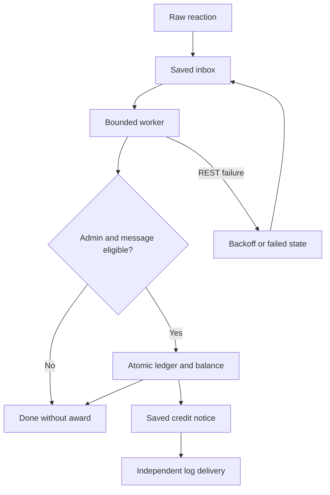

# Melee Zone V3 architecture

## Main application

`bot.py` loads 19 extensions and registers 53 root application commands, including two message context actions and the `/support` group with five executable subcommands. All user commands require a guild. Setup loads the additive SQLite schema before commands/workers become active. Failure to load a required extension aborts startup and appears in health.

`database.py` retains the V2 tables and interface. `operations_db.py` adds transaction boundaries, durable reaction inbox/outbox, activity index, report checkpoints, onboarding progress and operation audit. SQLite uses WAL, a five-second busy timeout and an application write lock. Network calls occur before or after write transactions, not inside them.

`runtime_utils.py` normalizes IDs, emoji identity, finite amounts and UTC times and resolves channel/thread destinations. `ui_security.py` applies current admin checks to management views/modals. `award_service.py` validates multi-member manual awards before starting the transaction.

## Reaction state

Award identity is `(message_id, admin_id, normalized_emoji)`. A transaction inserts that identity, inserts the ledger row and increments the recipient balance. It commits all changes or none. Retrying can resend a notice after an acknowledgement interruption but cannot add another balance reward for the same identity.

Manual batch identity includes guild, actor, operation and recipient. A slash interaction retry shares an operation identity; a new user invocation is a new award. Snapshot confirmation carries its own persisted snapshot identity. Quick context awards key on message and actor.

Post score/showcase rewards and finalization share one transaction. Quiz result, session completion and reward share one transaction. Primary assignment creation checks remaining post slots and current-cycle primary capacity under the same write lock. Rescue handoff validates eligibility, inserts its new assignment and retires its original in one transaction.

## Role report pipeline

Roster collection uses a fresh Discord member inventory. A report records its role, roster, requestor, cutoff, upper timestamp, message allowance and job ID. The serial worker enumerates destinations and pages history in batches of up to 100. Only target-member messages enter the index; every fetched message counts toward the job's work budget.

A page's stored messages, newest-to-oldest cursor and examined-message count commit together. A crash before commit repeats that page safely because message IDs are unique. A crash after commit resumes from the next cursor. Cancellation has a DB update guard so a worker cannot overwrite cancelled state as complete.

States are queued, running, paused, complete and cancelled. Pending destinations resume. Skipped destinations and enumeration failures remain coverage evidence. Requesting a new report after permission correction rediscovers channels. No complete label is assigned while any destination is pending or skipped.

The exporter fills an XLSX template authored with Artifact Tool. Runtime generation uses Python's ZIP/XML standard library, adding no spreadsheet engine dependency to the VPS. IDs are text, dates are Excel dates in UTC, total MC is a SUM formula with a cached numeric value and user text is stored literally rather than interpreted as a formula. The four sheets retain filters, frozen headings and column formatting.

## Activity evidence

The configured reviewer role and explicitly selected roles are observed. Member messages store ID, guild, author, destination, parent, UTC creation time and a bounded excerpt. Recent reactions and bot interactions store event type, destination and observed time. Historical REST history can recover retained messages, not historical reaction creation times, presence/voice or deleted content.

Known message counts and window counts answer different questions. Recent observed records can be newer than a report's requested history bound. Roster is captured when requested; balances are read at export. These definitions are explicit in the moderator manual.

## Optional review support

`review_support_db.py` adds guild-scoped configuration/roster/volunteer tables, seeded weekly support assignments with frozen evidence, private evaluations/messages, independent second-look corrections and durable report jobs. It never updates MC balances or main review settings. `review_analytics.py` reads a separate bounded SQLite transaction; `review_support_xlsx.py` fills the second Artifact-authored XLSX template. CSV user text is escaped. IDs and UTC dates retain explicit XLSX types.

Three loops handle 15-minute allocation/report scheduling, a ten-second serial report worker and a 15-second private-message worker. Role inventories are complete before replacement. Up to 100 new tasks are prepared per pass; queued tasks never force a volunteer over their opted-in capacity. Skips and insufficient evidence carry no financial penalty. See REVIEW_SUPPORT.md for cutoff rules, source budgets, estimator boundaries and privacy.

## Health and independent recovery

`health_runtime.py` monitors SQLite, required extension load, event-loop delay, known loops, disk headroom and gateway readiness. Supported loop repair is limited to three attempts per loop per hour. Local HTTP endpoints and atomic heartbeats expose those facts.

`recovery_daemon.py` is a separate process with its own HTTP server and REST client. It uses a file lock, saved restart budget and a fixed allowlist of systemd actions. Local requests require a private secret and owner ID. Discord pulse requests require the pinned owner's reaction on the saved control message. It checks SQLite read-only before restart and does not execute arbitrary shell input.

## Files and state

| Location | Contents |
|---|---|
| `.env` | Existing production token/configuration; never distributed |
| `bot.db` or configured path | Ledger, users, old workflows and additive V3 tables |
| `runtime/heartbeat.json` | Private atomic health snapshot |
| `runtime/recovery.json` | Owner/control-message IDs |
| `runtime/recovery.secret` | Local recovery API secret, mode 0600 |
| `runtime/recovery-state.json` | Restart timestamps across watcher restart |
| `runtime/reports/` | Private role workbooks |
| `backups/` | Daily/manual/upgrade backup sets |
| `.releases/VERSION-TIMESTAMP/venv/` | Isolated Python environment for the installed unit |

Multiple guild configurations remain supported by the main bot. Recovery control is one deployment-level owner/control message, not a separate independent recovery policy per guild.

## Deliberate boundaries

The implementation does not promise exactly-once Discord message delivery, unlimited memory, guaranteed availability during a host outage or perfect historical member activity. Financial database identities are idempotent, API work is bounded and missing evidence stays visible. Existing quiz sessions depend on live interaction UI while being taken; an incomplete quiz can require starting again. Showcase/role delivery failures can require moderator repair even when the financial result is safely committed.
